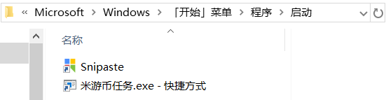

# Miyoushe-Auto
米游社自动化，支持多账号

**现有功能**  
- 自动完成米游币任务 

## 注意事项
1. **user_info.json文件中的内容切勿透露给任何人，由此造成一切后果均与本人无关！！！**
2. 为了能够长久的使用，不要在各大公共平台肆意传播

## 使用方法
[点击这里](https://github.com/Yoimiya-993/Miyoushe-Auto/releases/latest) 下载，解压后进入文件夹即可使用

## 将米游币任务配置成开机自启动
**目的:** 配置成开机自启动后，每天电脑开机的时候就会自动运行，就不会忘记了  
**前提:** 已经使用`添加米游社账号.exe`程序添加好了所需的账号  
**步骤:**
1. 为`米游币任务.exe`创建快捷方式（win10在鼠标右键->创建快捷方式）

2. 按快捷键“Win + R”打开运行对话框，在其中输入`shell:startup`并按下回车键

3. 在弹出的窗口中，将第1步创建的快捷方式拖入其中
  
此时可以重启电脑验证下自启动项是否配置成功